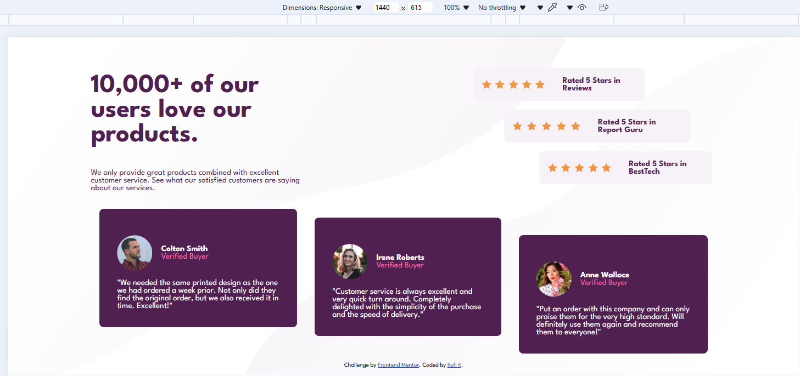
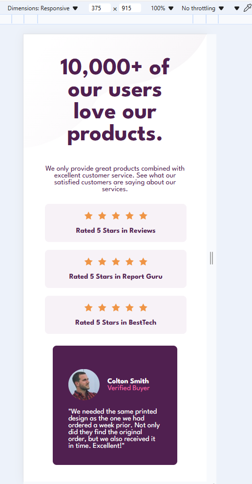
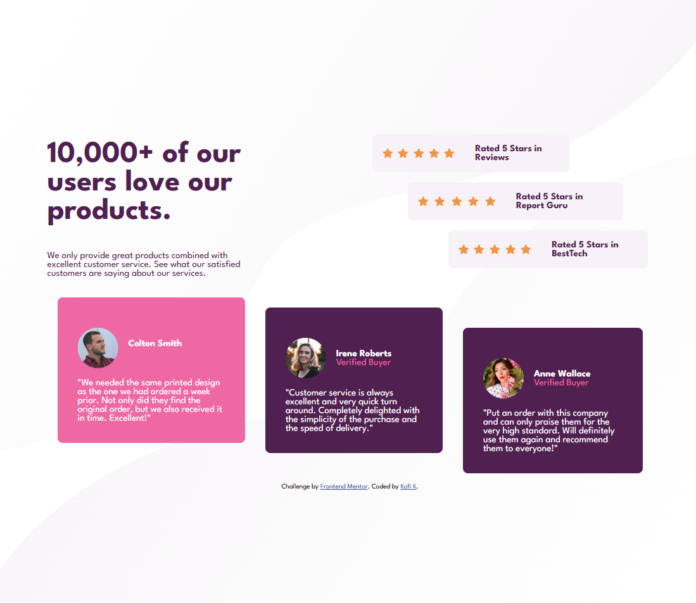

# Frontend Mentor - Social proof section solution

This is a solution to the [Social proof section challenge on Frontend Mentor](https://www.frontendmentor.io/challenges/social-proof-section-6e0qTv_bA). Frontend Mentor challenges help you improve your coding skills by building realistic projects. 

## Table of contents

- [Overview](#overview)
  - [The challenge](#the-challenge)
  - [Screenshot](#screenshot)
  - [Links](#links)
- [My process](#my-process)
  - [Built with](#built-with)
  - [What I learned](#what-i-learned)
  - [Continued development](#continued-development)
  - [Useful resources](#useful-resources)
- [Author](#author)
- [Acknowledgments](#acknowledgments)

**Note: Delete this note and update the table of contents based on what sections you keep.**

## Overview

### The challenge

Users should be able to:

- View the optimal layout for the section depending on their device's screen size

### Screenshot



Desktop Mode



Mobile Mode




Custom Active State
<!-- Add a screenshot of your solution. The easiest way to do this is to use Firefox to view your project, right-click the page and select "Take a Screenshot". You can choose either a full-height screenshot or a cropped one based on how long the page is. If it's very long, it might be best to crop it.

Alternatively, you can use a tool like [FireShot](https://getfireshot.com/) to take the screenshot. FireShot has a free option, so you don't need to purchase it. 

Then crop/optimize/edit your image however you like, add it to your project, and update the file path in the image above.

**Note: Delete this note and the paragraphs above when you add your screenshot. If you prefer not to add a screenshot, feel free to remove this entire section.** -->

### Links

- Solution URL: [Add solution URL here](https://your-solution-url.com)
- Live Site URL: [https://kofi100.github.io/SocialProof-HTMLProject02Dec2024/](https://kofi100.github.io/SocialProof-HTMLProject02Dec2024/)

## My process

### Built with

- Semantic HTML5 markup
- CSS custom properties
- Flexbox


### What I learned

I revisited my knowledge on flexbox to create columns and rows to create each section of the site. It was nice ngl.

I also think I managed to use my new knowledge on semantic elements in order to section the web page so that it is easy to figure out
where each stuff in the webpage is.


```html

```


If you want more help with writing markdown, we'd recommend checking out [The Markdown Guide](https://www.markdownguide.org/) to learn more.

**Note: Delete this note and the content within this section and replace with your own learnings.**

### Continued development
For now, I think I'll practise more with semantic elements and using flexbox and maybe more needed grid so that I can be able to develop 
good looking webpages asap.

### Useful resources

- [W3Schools on Semantic Elements](https://www.w3schools.com/html/html5_semantic_elements.asp) - If you wanna use semantic elements to structure your work, this si a good place to learn from.


## Author

- Website - [Add your name here](https://www.your-site.com)
- Frontend Mentor - [@Kofi100](https://www.frontendmentor.io/profile/Kofi100)
- Twitter - [@yourusername](https://www.twitter.com/yourusername)


## Acknowledgments

This is where you can give a hat tip to anyone who helped you out on this project. Perhaps you worked in a team or got some inspiration from someone else's solution. This is the perfect place to give them some credit.

**Note: Delete this note and edit this section's content as necessary. If you completed this challenge by yourself, feel free to delete this section entirely.**
